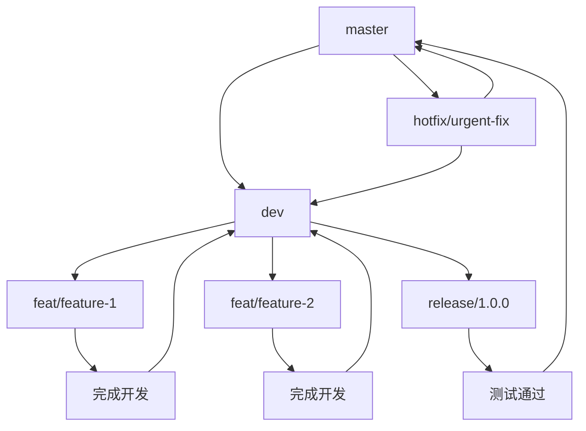

# 🌿 Git规范文档

## 📋 分支管理规范

### 🌳 分支类型

| 分支类型      | 命名规范                         | 说明            | 示例                          |
|-----------|------------------------------|---------------|-----------------------------|
| **主分支**   | `master`                     | 生产环境分支，稳定可发布  | `master`                    |
| **开发分支**  | `dev`                        | 开发环境分支，集成最新功能 | `dev`                       |
| **功能分支**  | `feat/{feature-name}`        | 新功能开发分支       | `feat/user-authentication`  |
| **修复分支**  | `fix/{bug-description}`      | 问题修复分支        | `fix/login-bug`             |
| **重构分支**  | `refactor/{module-name}`     | 代码重构分支        | `refactor/module-structure` |
| **性能分支**  | `perf/{optimization}`        | 性能优化分支        | `perf/table-rendering`      |
| **发布分支**  | `release/{version}`          | 发布准备分支        | `release/1.0.0`             |
| **热修复分支** | `hotfix/{issue-description}` | 紧急修复分支        | `hotfix/security-patch`     |

### 🔄 分支工作流



## 📝 提交信息规范

### 🎯 提交类型

| 类型           | 说明        | 示例                             |
|--------------|-----------|--------------------------------|
| **feat**     | 新功能       | `feat(user-auth): 添加用户认证功能`    |
| **fix**      | 问题修复      | `fix(login): 修复登录验证逻辑`         |
| **docs**     | 文档更新      | `docs(readme): 更新项目说明文档`       |
| **style**    | 代码风格调整    | `style(eslint): 调整代码格式化规则`     |
| **refactor** | 代码重构      | `refactor(service): 重构用户服务层`   |
| **perf**     | 性能优化      | `perf(query): 优化数据库查询性能`       |
| **test**     | 测试相关      | `test(unit): 添加用户服务单元测试`       |
| **chore**    | 构建工具、依赖更新 | `chore(deps): 升级Spring Boot版本` |
| **ci**       | 持续集成      | `ci(github): 配置GitHub Actions` |
| **revert**   | 回滚提交      | `revert: 回滚feat/user-auth提交`   |

### 📋 提交信息格式

```
<type>(<scope>): <description>

[optional body]

[optional footer(s)]
```

**格式说明：**
- **type**: 提交类型（必填）
- **scope**: 影响范围（可选）
- **description**: 简短描述（必填）
- **body**: 详细描述（可选）
- **footer**: 相关issue或breaking change（可选）

### ✅ 提交信息示例

#### 新功能
```bash
feat(user): 添加用户注册功能

- 支持邮箱注册
- 支持手机号注册
- 添加邮箱验证
- 添加手机验证码验证

Closes #123
```

#### 问题修复
```bash
fix(auth): 修复JWT token过期处理

修复token过期后自动刷新逻辑，避免重复请求

Fixes #456
```

#### 重构
```bash
refactor(service): 重构用户服务层

- 提取公共方法
- 优化异常处理
- 统一返回格式

BREAKING CHANGE: 用户服务接口返回值格式变更
```

## 🚀 分支命名规范

### 📝 命名规则

1. **使用小写字母和连字符**
2. **描述性命名，清晰表达意图**
3. **避免使用特殊字符**
4. **长度控制在50字符以内**

### 🎯 命名示例

#### 功能分支
```bash
# 新功能
feat/user-authentication
feat/payment-integration
feat/data-export

# 功能增强
feat/enhance-search-performance
feat/add-bulk-operations
```

#### 修复分支
```bash
# Bug修复
fix/login-validation-error
fix/memory-leak-issue
fix/api-timeout-problem

# 安全修复
fix/security-vulnerability
fix/xss-protection
```

#### 重构分支
```bash
# 代码重构
refactor/user-service-layer
refactor/database-connection
refactor/api-response-format

# 架构重构
refactor/microservice-architecture
refactor/cache-strategy
```

#### 性能优化
```bash
# 性能优化
perf/database-query-optimization
perf/frontend-rendering
perf/api-response-caching
```

## 🔧 发布流程规范

### 📦 版本发布流程

```bash
# 1. 确保开发分支是最新的
git checkout dev
git pull origin dev

# 2. 创建发布分支
git checkout -b release/1.0.0
git push -u origin release/1.0.0

# 3. 更新版本号
mvn versions:set -DnewVersion=1.0.0-RELEASE -DgenerateBackupPoms=false

# 4. 提交版本变更
git add .
git commit -m "chore: 更新版本号为1.0.0-RELEASE"
git push origin release/1.0.0

# 5. 创建发布标签
git tag 1.0.0
git push origin 1.0.0

# 6. 合并到主分支
git checkout master
git merge release/1.0.0
git push origin master

# 7. 更新开发分支版本号
git checkout dev
mvn versions:set -DnewVersion=1.1.0-SNAPSHOT -DgenerateBackupPoms=false
git add .
git commit -m "chore: 更新版本号为1.1.0-SNAPSHOT"
git push origin dev

# 8. 删除发布分支
git branch -d release/1.0.0
git push origin --delete release/1.0.0
```

### 🏷️ 版本号规范

采用 [语义化版本控制](https://semver.org/lang/zh-CN/) 规范：

```
主版本号.次版本号.修订号
```

- **主版本号**: 不兼容的API修改
- **次版本号**: 向下兼容的功能性新增
- **修订号**: 向下兼容的问题修正

**示例：**
- `1.0.0` - 初始版本
- `1.1.0` - 新增功能
- `1.1.1` - 修复问题
- `2.0.0` - 重大更新（不兼容）

## 🔒 代码审查规范

### 📋 审查清单

#### 代码质量
- [ ] 代码符合项目规范
- [ ] 无明显的性能问题
- [ ] 异常处理完善
- [ ] 日志记录适当
- [ ] 单元测试覆盖

#### 安全性
- [ ] 无安全漏洞
- [ ] 敏感信息保护
- [ ] 权限控制正确
- [ ] 输入验证充分

#### 文档
- [ ] 代码注释清晰
- [ ] API文档更新
- [ ] 变更日志记录
- [ ] 部署说明更新

### 🎯 审查流程

1. **创建Pull Request**
2. **指定审查者**
3. **自动检查通过**
4. **代码审查通过**
5. **合并到目标分支**

### 📊 分支保护规则

#### master分支保护
- 禁止直接推送
- 必须通过Pull Request
- 必须通过代码审查
- 必须通过CI检查

#### dev分支保护
- 禁止直接推送
- 必须通过Pull Request
- 必须通过CI检查

## 🚀 最佳实践

### ✅ 推荐做法

1. **频繁提交**: 小步快跑，频繁提交
2. **清晰描述**: 提交信息要清晰描述变更内容
3. **分支隔离**: 不同功能使用不同分支
4. **及时合并**: 功能完成后及时合并到主分支
5. **定期同步**: 定期同步远程分支

### ❌ 避免做法

1. **避免大提交**: 不要一次性提交大量变更
2. **避免直接推送**: 不要直接推送到保护分支
3. **避免无意义提交**: 不要提交无意义的变更
4. **避免强制推送**: 不要使用 `git push --force`
5. **避免忽略冲突**: 不要忽略合并冲突

## 📚 常用命令

### 🔧 基础命令
```bash
# 查看状态
git status

# 添加文件
git add .

# 提交变更
git commit -m "feat: 添加新功能"

# 推送分支
git push origin branch-name

# 拉取更新
git pull origin branch-name
```

### 🌿 分支操作
```bash
# 创建分支
git checkout -b feature/new-feature

# 切换分支
git checkout branch-name

# 删除分支
git branch -d branch-name

# 查看分支
git branch -a
```

### 🔄 合并操作
```bash
# 合并分支
git merge source-branch

# 变基操作
git rebase target-branch

# 解决冲突
git add .
git commit -m "resolve conflicts"
```